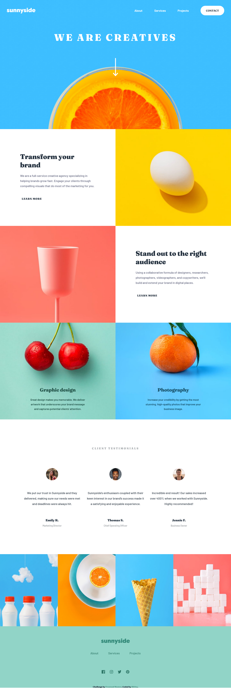
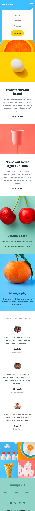

# Frontend Mentor - Sunnyside agency landing page solution

This is a solution to the [Sunnyside agency landing page challenge on Frontend Mentor](https://www.frontendmentor.io/challenges/sunnyside-agency-landing-page-7yVs3B6ef). Frontend Mentor challenges help you improve your coding skills by building realistic projects.

## Table of contents

- [Overview](#overview)
  - [The challenge](#the-challenge)
  - [Screenshot](#screenshot)
  - [Links](#links)
- [My process](#my-process)
  - [Built with](#built-with)
  - [What I learned](#what-i-learned)
  - [Continued development](#continued-development)
- [Author](#author)
- [Acknowledgments](#acknowledgments)

## Overview

### The challenge

Users should be able to:

- View the optimal layout for the site depending on their device's screen size
- See hover states for all interactive elements on the page

### Screenshot

- Desktop View

- Mobile View

### Links

- [solution URL](https://github.com/rh0se/sunnyside-agency-landing-page-main)
- [live site](https://rh0se.github.io/sunnyside-agency-landing-page-main/)

## My process

### Built with

- Semantic HTML5 markup
- CSS custom properties
- Flexbox
- CSS Grid
- Mobile-first workflow

### What I learned

### Continued development

I would love to continue using on CSS Grid in future projects i really found easier to implement

## Author

- Frontend Mentor - [@rh0se](https://www.frontendmentor.io/profile/rh0se)
- Linkedin - [Rhoda](www.linkedin.com/in/rhoda-ojetola)

## Acknowledgments
Thanks to frontend queens community for giving me this challenge

